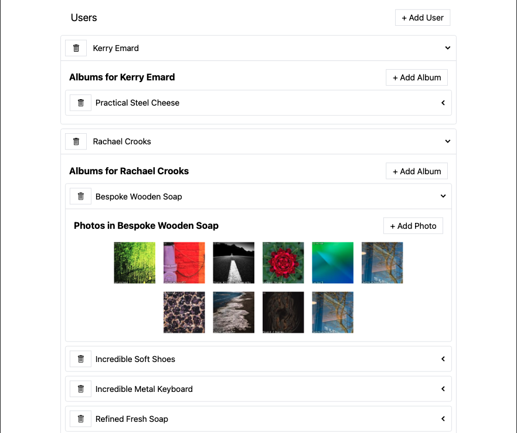

# Media-App-Redux 

  ## Description

  This is an app build with a React front end, Redux/Redux Toolkit for state management, and JSON server for the back end.   The app allows the user to add random users, albums, and photos to add albums and photos. Users, albums, and photos can be removed as well.
  
  Screenshot of app:

  

  ## Table of Contents
  
  - [Installation](#installation)
  - [Usage](#usage)
  - [License](#license)
  - [Contributing](#contributing)
  - [Tests](#tests)
  - [Questions](#questions)
  
  ## Installation
  
  npm install
  
  ## Usage
  
  npm start

  ## License
This application is covered under the MIT License.
 For more information: https://opensource.org/licenses/MIT
  
  ## Contributing
  N/A
  
  ## Tests
  N/A

  ## Questions
  Contact Info 
  GitHub user name: BillStephens2022 
  Link to GitHub profile: https://github.com/BillStephens2022 
  Email: stephensbill17@gmail.com